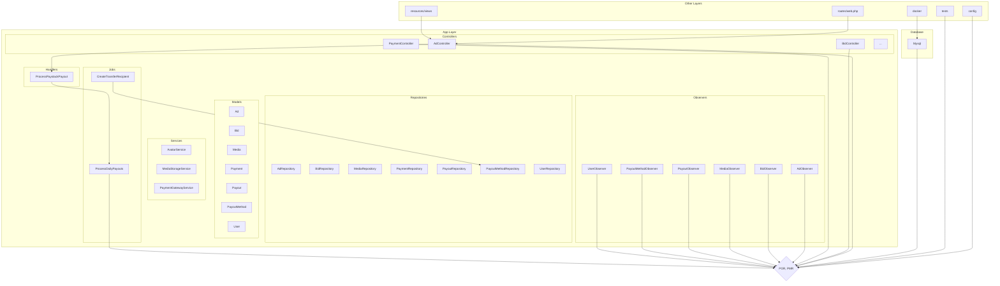

<div align="center">
  
  <br/>
  <h3><b>Bazaar Auction Marketplace</b></h3>
    <p>
        <b>📢 The Open Source Ad Auction Marketplace</b>
    </p>
    <p>
        <a href="https://github.com/hendurhance/bazaar/issues/new?assignees=&labels=&template=bug_report.md&title=">Report Bug</a>
        ·
        <a href="https://github.com/hendurhance/bazaar/issues/new?assignees=&labels=&template=feature_request.md&title=">Request Feature</a>
    </p>
</div>

> If you are here for the nitty-gritty details, you can check out the **[technical documentation](/docs/TECHNICAL_DOCUMENTATION.md)** for the system design, architecture, and design patterns used in the application. You can also check out the **[features](/docs/FEATURES.md)** page for a detailed list of features, and screenshots with key highlights, and live demo.

# 📗 Table of Contents <a name="table-of-contents"></a>

- [📗 Table of Contents](#table-of-contents)
- [📖 About Bazaar](#about-bazaar)
  - [🛠 Built With](#built-with)
    - [Tech Stack](#tech-stack)
    - [Key Features](#key-features)
  - [🚀 Live Demo](#live-demo)
- [💻 Getting Started](#getting-started)
  - [Prerequisites](#prerequisites)
  - [Installation](#installation)
    - [💻 Local Machine](#local-machine)
    - [🐳 Docker](#docker)
    - [📦 Usage](#usage)
    - [🧪 Testing](#testing)
    - [👨🏽‍💻 Deployment](#deployment)
    - [📁 File Structure](#file-structure)
- [🔭 Future Features](#future-features)
- [🤝 Contributing](#contributing)
- [👥 Authors](#authors)
- [❓ FAQ](#faq)
- [📝 License](#license)
- [⭐️ Support](#️support)
  
<div align="center">

</div>

# 📖 About Bazaar <a name="about-bazaar"></a>
> Bazaar is an auction marketplace where users can buy and sell items. Users can create an account, list items for sale, bid on items, and view their own items and bids.

## 🛠 Built With <a name="built-with"></a>
### Tech Stack
> Bazaaar is built with on PHP Laravel framework and uses MySQL for the database. The front end is also handled by Laravel's Blade templating engine.
<table>
  <tr>
    <td align="center"><a href="https://php.net/"></a></td>
    <td align="center"><a href="https://laravel.com/"></a></td>
    <td align="center"><a href="https://www.mysql.com/"></a></td>
    <td align="center"><a href="https://www.javascript.com/"></a></td>
    <td align="center"><a href="https://getbootstrap.com/"></a></td>
    <td align="center"><a href="https://www.w3.org/html/"></a></td>
    </tr>
</table>

<p align="right">(<a href="#table-of-contents">back to top</a>)</p>

### Key Features <a name="key-features"></a>oc
Bazaar is a full-stack web application that allows users to:
1. **📢 Ad Auction Marketplace** - Users can create an account, list items for sale, and manage their listings. Share your listings with friends and family on social media.
2. **💰 Bidding** - Users can bid on items and view their bids, get notified when they are outbid, and get notified when they win an auction.
3. **🔎 Search** - Users can search for items by name, description, or category.
4. **📊 Advanced Analytics** - Users can view their sales and bids in a dashboard with charts and graphs.
5. **👨‍👩‍👦 User Dashboard** - Users can view their listings, bids, payments, and payouts history.
6. **📱 Admin Dashboard** - Admins can manage users, listings, and bids .etc
7. **🔒 Authentication** - Users can create an account and login to the application. Manage their account settings and password.
8. **📧 In-built Blog CMS** - Admins can create blog posts and manage them. Users can view blog posts and comment on them. 
9. **📧 Comment Moderation** - Admins can moderate comments on blog posts.
10. **📧 Email Notifications** - Users get email notifications on events such as outbid, winning an auction, payment confirmation, and more.
11. **📧 Payment Processor** - Users can pay for items using payment gateways such as Paystack, and Flutterwave.
12. **📧 Payouts Processor** - Job workflow for paying Ad Owners for sales of ads auctioned automatically.
13. **📤 Support Ticketing** - Users can create support tickets and admins can respond to them.
14. **🔒 Fully Open Source:** You can self-host the entire stack on your servers.

If you want to see a detailed list of features, and screenshots with key highlights, and live demo check out the [features](/docs/FEATURES.md) page.

## 🚀 Live Demo <a name="live-demo"></a>
> You can watch a live demo of the application below.

https://github.com/hendurhance/bazaar/assets/50846992/3191f5a3-8048-4ded-8f41-f5a1197a349e

<p align="right">(<a href="#table-of-contents">back to top</a>)</p>

# 💻 Getting Started <a name = "getting-started"></a>
## Prerequisites <a name="prerequisites"></a>
> You need to have the following installed on your machine to run the application locally.
- [PHP](https://www.php.net/downloads.php)
- [Composer](https://getcomposer.org/download/)
- [MySQL](https://www.mysql.com/downloads/)
- [Docker](https://www.docker.com/products/docker-desktop)
- [Git](https://git-scm.com/downloads)

<p align="right">(<a href="#table-of-contents">back to top</a>)</p>

## Installation <a name="installation"></a>
### 💻 Local Machine <a name="local-machine"></a>
<details>
<summary>Click to expand installation instructions for local machine</summary>

- **Step 1:** To get started, you need to clone the repository to your local machine. You can do this by running the command below in your terminal.
    ```bash
    git clone https://github.com/hendurhance/bazaar.git
    ```
- **Step 2:** Navigate to the root directory using the command below.
    ```bash
    cd bazaar
    ```
- **Step 3:** Install the dependencies using the bash script below. Make sure you give the script execution permission by running `chmod +x ./scripts/*.sh` before running the script.
    ```bash
    ./scripts/dependencies.sh
    ```
- **Step 4:** Create a `.env` file in the root directory of the project. You can do this by copying the `.env.example` file and renaming it to `.env`.
    ```bash
    cp .env.example .env
    ```
- **Step 5:** Set up your environment variables for database credentials and other settings. You can do this by filling these values in the `.env` file.
    ```env
    ...
    DB_CONNECTION=mysql
    DB_HOST=<YOUR_DB_HOST>
    DB_PORT=<YOUR_DB_PORT>
    DB_DATABASE=<YOUR_DB_NAME>
    DB_USERNAME=<YOUR_DB_USERNAME>
    DB_PASSWORD=<YOUR_DB_PASSWORD>
    ...

    FLUTTERWAVE_SECRET_KEY=<FLUTTERWAVE_SECRET_KEY>
    FLUTTERWAVE_PUBLIC_KEY=<FLUTTERWAVE_PUBLIC_KEY>
    FLUTTERWAVE_ENCRYPTION_KEY=<FLUTTERWAVE_ENCRYPTION_KEY>
    FLUTTERWAVE_REDIRECT_URL=<FLUTTERWAVE_REDIRECT_URL>

    PAYSTACK_SECRET_KEY=<PAYSTACK_SECRET_KEY>
    PAYSTACK_PUBLIC_KEY=<PAYSTACK_PUBLIC_KEY>
    PAYSTACK_REDIRECT_URL=<PAYSTACK_REDIRECT_URL>

    RECAPTCHA_SITE_KEY=<RECAPTCHA_SITE_KEY>
    RECAPTCHA_SECRET_KEY=<RECAPTCHA_SECRET_KEY>
    ```
    You mainly need to fill in the database credentials which is important for the application to run. The other values are for the payment gateways and recaptcha. You can get the payment gateway credentials by creating an account on [Paystack](https://paystack.com/) and [Flutterwave](https://flutterwave.com/). You can get the recaptcha credentials by creating an account on [Google Recaptcha](https://www.google.com/recaptcha/about/).

- **Step 6:** After setting up dependencies and environment variables, you need to run the database migrations to create the database tables. You can do this by using the script below.
     ```bash
    ./scripts/localize.sh
    ```
- **Step 7:** After running the script above, you get a link to the application. You can visit the link to view the application.
</details>

### 🐳 Docker <a name="docker"></a>
<details>
<summary>Click to expand installation instructions for docker</summary>

- **Step 1:** To get started, you need to clone the repository to your local machine. You can do this by running the command below in your terminal.
    ```bash
    git clone https://github.com/hendurhance/bazaar.git
    ```
- **Step 2:** Navigate to the root directory using the command below.
    ```bash
    cd bazaar
    ```
- **Step 3:** Create a `.env` file in the root directory of the project. You can do this by copying the `.env.docker` file and renaming it to `.env`.
    ```bash
    cp .env.docker .env
    ```
- **Step 4:** Run the docker compose command below to start the application.
    ```bash
    docker-compose up -d
    ```
- **Step 5:** Open bash in the container using the command below.
    ```bash
    docker exec -it bazaar-app-1 bash
    ```
- **Step 6:** Make sure you are in the root directory of the project in the container. You can do this by running the command below.
    ```bash
    cd /var/www/html
    ```
- **Step 7:** Run the database migrations to create the database tables. You can do this by using the script below. Make sure you give the script execution permission by running `chmod +x ./scripts/*.sh` before running the script.
     ```bash
    ./scripts/dockerize.sh
    ```
- **Step 8:** After running the script above, you get a link to the application. You can visit the link to view the application.
- **Step 8:** To stop the application, run the command below.
    ```bash
    docker-compose down
    ```
</details>

<p align="right">(<a href="#table-of-contents">back to top</a>)</p>

### 📦 Usage <a name="usage"></a>
> You can watch a video on how to use the application below.

[](https://vimeo.com/894921005?share=copy)

There are a few accounts you can use to test the application after proper installation. You can find the credentials below.
| Name | Email | Password | Role |
| --- | --- | --- | --- |
| Bazaar Admin | admin@bazaar.com | password | Admin |
| Bazaar User | user@bazaar.com | password | User |

<p align="right">(<a href="#table-of-contents">back to top</a>)</p>

### 🧪 Testing <a name="testing"></a>
__Coming Soon__

### 👨🏽‍💻 Deployment <a name="deployment"></a>
You can deploy the application to a server using either the docker method or the local machine method. You can find the instructions for both methods below.
| Method | Link |
| --- | --- |
|🐳 Docker | [Docker Deployment](#🐳-docker) |
|💻 Local Machine | [Local Machine Deployment](#💻-local-machine) |

<p align="right">(<a href="#table-of-contents">back to top</a>)</p>

### 📁 File Structure <a name="file-structure"></a>
> The project adheres to Laravel's MVC architecture, employing design patterns for clean separation of concerns. The Repository Pattern is utilized to isolate business logic from controllers, promoting maintainability and scalability. Additionally, the Observer Pattern is employed to manage events on models.


<details>
<summary>Click to expand file structure</summary>

```
.
├── app
│   ├── Abstracts
│   │   ├── BaseAvatarService.php
│   │   ├── BaseCrudRepository.php
│   │   └── BaseMediaStorageService.php
│   ├── Console
│   │   ├── Commands
│   │   │   ├── MakeInterfaceCommand.php
│   │   │   └── MakeRepositoryCommand.php
│   │   └── Kernel.php
│   ├── Contracts
│   │   ├── Repositories
│   │   │   ├── AdRepositoryInterface.php
│   │   │   ├── AdminAdRepositoryInterface.php
│   │   │   ├── AdminBidRepositoryInterface.php
│   │   │   ├── AdminPaymentRepositoryInterface.php
│   │   │   ├── AdminPayoutMethodRepositoryInterface.php
│   │   │   ├── AdminPayoutRepositoryInterface.php
│   │   │   ├── AnalyticRepositoryInterface.php
│   │   │   ├── AuthenticateRepositoryInterface.php
│   │   │   ├── BidRepositoryInterface.php
│   │   │   ├── CategoryRepositoryInterface.php
│   │   │   ├── CommentRepositoryInterface.php
│   │   │   ├── CountryRepositoryInterface.php
│   │   │   ├── MediaRepositoryInterface.php
│   │   │   ├── MetricRepositoryInterface.php
│   │   │   ├── PaymentRepositoryInterface.php
│   │   │   ├── PayoutMethodRepositoryInterface.php
│   │   │   ├── PayoutRepositoryInterface.php
│   │   │   ├── PostRepositoryInterface.php
│   │   │   ├── SupportRepositoryInterface.php
│   │   │   ├── TagRepositoryInterface.php
│   │   │   └── UserRepositoryInterface.php
│   │   ├── Services
│   │   │   ├── AvatarServiceInterface.php
│   │   │   ├── BankCodeServiceInterface.php
│   │   │   ├── MediaStorageServiceInterface.php
│   │   │   └── PaymentGatewayServiceInterface.php
│   │   └── Types
│   │       ├── HasAll.php
│   │       ├── HasColor.php
│   │       └── HasLabel.php
│   ├── Enums
│   │   ├── AdStatus.php
│   │   ├── AdType.php
│   │   ├── CommentStatus.php
│   │   ├── Gender.php
│   │   ├── MediaType.php
│   │   ├── PaymentGateway.php
│   │   ├── PaymentStatus.php
│   │   ├── PayoutGateway.php
│   │   ├── PayoutStatus.php
│   │   ├── PriceRange.php
│   │   ├── StorageDiskType.php
│   │   └── SupportStatusEnum.php
│   ├── Exceptions
│   │   ├── AdException.php
│   │   ├── AuthenticateException.php
│   │   ├── BidCustomException.php
│   │   ├── BidException.php
│   │   ├── CommentException.php
│   │   ├── Handler.php
│   │   ├── MediaException.php
│   │   ├── PaymentException.php
│   │   ├── PayoutException.php
│   │   ├── PayoutMethodException.php
│   │   ├── PostException.php
│   │   ├── SupportException.php
│   │   └── UserException.php
│   ├── Handler
│   │   ├── PaystackWebhookSignature.php
│   │   ├── ProcessPaystackPayout.php
│   │   └── ProcessPaystackWebhook.php
│   ├── Helpers
│   │   └── Helpers.php
│   ├── Http
│   │   ├── Controllers
│   │   │   ├── Admin
│   │   │   │   ├── Ad
│   │   │   │   │   └── AdController.php
│   │   │   │   ├── Auth
│   │   │   │   │   ├── LoginController.php
│   │   │   │   │   └── PasswordController.php
│   │   │   │   ├── Bid
│   │   │   │   │   └── BidController.php
│   │   │   │   ├── Dashboard
│   │   │   │   │   └── MetricsController.php
│   │   │   │   ├── Media
│   │   │   │   │   └── MediaController.php
│   │   │   │   ├── Payment
│   │   │   │   │   └── PaymentController.php
│   │   │   │   ├── Payout
│   │   │   │   │   ├── PayoutController.php
│   │   │   │   │   └── PayoutMethodController.php
│   │   │   │   ├── Post
│   │   │   │   │   ├── CommentController.php
│   │   │   │   │   └── PostController.php
│   │   │   │   ├── Profile
│   │   │   │   │   └── ProfileController.php
│   │   │   │   ├── Search
│   │   │   │   │   └── SearchController.php
│   │   │   │   ├── Support
│   │   │   │   │   └── SupportController.php
│   │   │   │   └── User
│   │   │   │       └── UserController.php
│   │   │   ├── Api
│   │   │   │   ├── CategoryController.php
│   │   │   │   └── CountryController.php
│   │   │   ├── Controller.php
│   │   │   ├── Page
│   │   │   │   ├── BlogController.php
│   │   │   │   ├── CommentController.php
│   │   │   │   ├── ContactController.php
│   │   │   │   └── HomeController.php
│   │   │   └── User
│   │   │       ├── Ad
│   │   │       │   └── AdController.php
│   │   │       ├── Auth
│   │   │       │   ├── LoginController.php
│   │   │       │   ├── PasswordController.php
│   │   │       │   └── RegisterController.php
│   │   │       ├── Bid
│   │   │       │   └── BidController.php
│   │   │       ├── Payment
│   │   │       │   └── PaymentController.php
│   │   │       ├── Payout
│   │   │       │   ├── PayoutController.php
│   │   │       │   └── PayoutMethodController.php
│   │   │       └── Profile
│   │   │           └── ProfileController.php
│   │   ├── Kernel.php
│   │   ├── Middleware
│   │   │   ├── Authenticate.php
│   │   │   ├── EncryptCookies.php
│   │   │   ├── EnsureAccountActive.php
│   │   │   ├── EnsureEmailVerified.php
│   │   │   ├── IncreaseAdViews.php
│   │   │   ├── PreventRequestsDuringMaintenance.php
│   │   │   ├── RedirectIfAuthenticated.php
│   │   │   ├── TrimStrings.php
│   │   │   ├── TrustHosts.php
│   │   │   ├── TrustProxies.php
│   │   │   ├── ValidateSignature.php
│   │   │   └── VerifyCsrfToken.php
│   │   └── Requests
│   │       ├── Ad
│   │       │   ├── CreateAdRequest.php
│   │       │   ├── CreateBidRequest.php
│   │       │   ├── FilterAdRequest.php
│   │       │   ├── FilterAdminAdsRequest.php
│   │       │   ├── FilterUserAdsRequest.php
│   │       │   ├── ReportAdRequest.php
│   │       │   ├── UpdateAdAdminRequest.php
│   │       │   └── UpdateAdRequest.php
│   │       ├── Auth
│   │       │   ├── ForgotPasswordRequest.php
│   │       │   ├── LoginRequest.php
│   │       │   ├── RegisterRequest.php
│   │       │   └── ResetPasswordRequest.php
│   │       ├── Bid
│   │       │   ├── FilterAdminBidRequest.php
│   │       │   └── FilterUserBidRequest.php
│   │       ├── Media
│   │       │   └── FilterAdminMediaRequest.php
│   │       ├── Payment
│   │       │   ├── CreatePayRequest.php
│   │       │   ├── FilterAdminPaymentRequest.php
│   │       │   ├── FilterUserPaymentRequest.php
│   │       │   └── UpdatePaymentAdminStatus.php
│   │       ├── Payout
│   │       │   ├── CreatePayoutMethodRequest.php
│   │       │   ├── FilterAdminPayoutMethodRequest.php
│   │       │   ├── FilterAdminPayoutRequest.php
│   │       │   └── RequestPayout.php
│   │       ├── Post
│   │       │   ├── CreateCommentRequest.php
│   │       │   ├── CreatePostRequest.php
│   │       │   ├── FilterAdminCommentRequest.php
│   │       │   ├── FilterAdminPostRequest.php
│   │       │   ├── FilterPostRequest.php
│   │       │   ├── UpdateCommentRequest.php
│   │       │   └── UpdatePostRequest.php
│   │       ├── Profile
│   │       │   ├── UpdateAdminPasswordRequest.php
│   │       │   ├── UpdateAdminProfileRequest.php
│   │       │   └── UpdateProfileRequest.php
│   │       ├── Search
│   │       │   └── SearchQueryRequest.php
│   │       ├── Support
│   │       │   ├── CreateSupportRequest.php
│   │       │   ├── FilterAdminSupportRequest.php
│   │       │   └── UpdateSupportRequest.php
│   │       └── User
│   │           ├── CreateAdminUserRequest.php
│   │           ├── FilterAdminUserRequest.php
│   │           └── UpdateAdminUserRequest.php
│   ├── Jobs
│   │   ├── CreateTransferRecipient.php
│   │   ├── ProcessDailyPayouts.php
│   │   ├── ProcessHighestBidder.php
│   │   └── TieUserToAds.php
│   ├── Models
│   │   ├── Ad.php
│   │   ├── Admin.php
│   │   ├── Bid.php
│   │   ├── Category.php
│   │   ├── City.php
│   │   ├── Comment.php
│   │   ├── Country.php
│   │   ├── Media.php
│   │   ├── Payment.php
│   │   ├── Payout.php
│   │   ├── PayoutMethod.php
│   │   ├── Post.php
│   │   ├── ReportAd.php
│   │   ├── State.php
│   │   ├── Support.php
│   │   ├── Tag.php
│   │   ├── Timezone.php
│   │   └── User.php
│   ├── Notifications
│   │   ├── Ad
│   │   │   ├── AdCreatedNotification.php
│   │   │   └── AdStatusUpdatedNotification.php
│   │   ├── Bid
│   │   │   ├── BidAcceptedNotification.php
│   │   │   ├── BidCreatedNotification.php
│   │   │   └── BidRejectedNotification.php
│   │   ├── Payment
│   │   │   └── BidPaymentNotification.php
│   │   ├── Payout
│   │   │   ├── PayoutMethodCreatedNotification.php
│   │   │   ├── PayoutRequestNotification.php
│   │   │   └── PayoutStatusNotification.php
│   │   ├── Support
│   │   │   └── SupportTicketNotification.php
│   │   └── User
│   │       ├── PasswordResetNotification.php
│   │       ├── UserVerificationNotification.php
│   │       └── WelcomeEmailNotification.php
│   ├── Observers
│   │   ├── AdObserver.php
│   │   ├── MediaObserver.php
│   │   ├── PayoutMethodObserver.php
│   │   └── UserObserver.php
│   ├── Providers
│   │   ├── AppServiceProvider.php
│   │   ├── AuthServiceProvider.php
│   │   ├── BroadcastServiceProvider.php
│   │   ├── EventServiceProvider.php
│   │   ├── RepositoryServiceProvider.php
│   │   └── RouteServiceProvider.php
│   ├── Repositories
│   │   ├── Ad
│   │   │   ├── Admin
│   │   │   │   └── AdminAdRepository.php
│   │   │   └── User
│   │   │       └── AdRepository.php
│   │   ├── Analytic
│   │   │   └── AnalyticRepository.php
│   │   ├── Auth
│   │   │   └── AuthenticateRepository.php
│   │   ├── Bid
│   │   │   ├── Admin
│   │   │   │   └── AdminBidRepository.php
│   │   │   └── User
│   │   │       └── BidRepository.php
│   │   ├── Category
│   │   │   └── CategoryRepository.php
│   │   ├── Country
│   │   │   └── CountryRepository.php
│   │   ├── Media
│   │   │   └── MediaRepository.php
│   │   ├── Metric
│   │   │   └── MetricRepository.php
│   │   ├── Payment
│   │   │   ├── Admin
│   │   │   │   └── AdminPaymentRepository.php
│   │   │   └── User
│   │   │       └── PaymentRepository.php
│   │   ├── Payout
│   │   │   ├── Admin
│   │   │   │   ├── AdminPayoutMethodRepository.php
│   │   │   │   └── AdminPayoutRepository.php
│   │   │   └── User
│   │   │       ├── PayoutMethodRepository.php
│   │   │       └── PayoutRepository.php
│   │   ├── Post
│   │   │   ├── CommentRepository.php
│   │   │   ├── PostRepository.php
│   │   │   └── TagRepository.php
│   │   ├── Support
│   │   │   └── SupportRepository.php
│   │   └── User
│   │       └── UserRepository.php
│   ├── Rules
│   │   └── Username.php
│   ├── Services
│   │   ├── Avatar
│   │   │   ├── BoringAvatar.php
│   │   │   ├── DiceBear.php
│   │   │   ├── Gravatar.php
│   │   │   └── UIAvatar.php
│   │   ├── Media
│   │   │   ├── LocalStorage.php
│   │   │   ├── MediaStorageService.php
│   │   │   └── S3Storage.php
│   │   ├── Payment
│   │   │   ├── PayWithFlutterwave.php
│   │   │   ├── PayWithPaystack.php
│   │   │   └── PaymentGatewayService.php
│   │   └── Payout
│   │       └── BankCodeService.php
│   ├── Traits
│   │   ├── ApiResponse.php
│   │   ├── HasAvatar.php
│   │   ├── HasMedia.php
│   │   ├── HasNameSplit.php
│   │   ├── HasPayoutToken.php
│   │   ├── HasSlug.php
│   │   ├── HasTransactionID.php
│   │   ├── HasUuids.php
│   │   ├── HasVerifiedEmail.php
│   │   ├── MediaHandler.php
│   │   └── PasswordEnvironments.php
│   └── View
│       └── Components
│           ├── AdFilterComponent.php
│           ├── AdItemCard.php
│           ├── AdStatusSelectable.php
│           ├── AdminAdTable.php
│           ├── AdminPaymentTable.php
│           ├── AdminPayoutTable.php
│           ├── AdminSupportTable.php
│           ├── AgreeCheckbox.php
│           ├── Alert.php
│           ├── BlogFilterComponent.php
│           ├── CategoriesCard.php
│           ├── CategorySelectable.php
│           ├── CountriesSelectable.php
│           ├── EditProfileCard.php
│           ├── FilterAdminBidCard.php
│           ├── FilterAdminCommentCard.php
│           ├── FilterAdminMediaCard.php
│           ├── FilterAdminPaymentCard.php
│           ├── FilterAdminPayoutCard.php
│           ├── FilterAdminPayoutMethodCard.php
│           ├── FilterAdminPostCard.php
│           ├── FilterAdminSupportCard.php
│           ├── FilterAdminUserCard.php
│           ├── GenderSelectable.php
│           ├── InputField.php
│           ├── InputItemField.php
│           ├── LocationSelectable.php
│           ├── MetricCard.php
│           ├── PayableForm.php
│           ├── PaymentFilterComponent.php
│           ├── PayoutForm.php
│           ├── PhoneSelectable.php
│           ├── PostTagCard.php
│           ├── ProfileAvatarCard.php
│           ├── TagSelectable.php
│           └── TextareaField.php
├── artisan
├── bootstrap
│   ├── app.php
│   └── cache
│       ├── packages.php
│       └── services.php
├── composer.json
├── composer.lock
├── config
│   ├── app.php
│   ├── auth.php
│   ├── broadcasting.php
│   ├── cache.php
│   ├── cors.php
│   ├── database.php
│   ├── filesystems.php
│   ├── hashing.php
│   ├── image.php
│   ├── laracaptcha.php
│   ├── logging.php
│   ├── mail.php
│   ├── payment.php
│   ├── queue.php
│   ├── sanctum.php
│   ├── services.php
│   ├── session.php
│   ├── view.php
│   └── webhook-client.php
├── database
│   ├── dump
│   │   ├── cities.sql
│   │   ├── countries.sql
│   │   ├── states.sql
│   │   └── timezones.sql
│   ├── factories
│   │   ├── AdFactory.php
│   │   ├── AdminFactory.php
│   │   ├── BidFactory.php
│   │   ├── CategoryFactory.php
│   │   ├── CommentFactory.php
│   │   ├── CountryFactory.php
│   │   ├── MediaFactory.php
│   │   ├── PaymentFactory.php
│   │   ├── PayoutFactory.php
│   │   ├── PayoutMethodFactory.php
│   │   ├── PostFactory.php
│   │   ├── ReportAdFactory.php
│   │   ├── SupportFactory.php
│   │   ├── TagFactory.php
│   │   └── UserFactory.php
│   ├── migrations
│   │   ├── 2019_12_14_000001_create_personal_access_tokens_table.php
│   │   ├── 2021_08_21_191921_create_countries_table.php
│   │   ├── 2021_08_21_191945_create_states_table.php
│   │   ├── 2021_08_21_191951_create_cities_table.php
│   │   ├── 2021_08_21_191958_create_timezones_table.php
│   │   ├── 2022_10_12_000000_create_users_table.php
│   │   ├── 2022_10_12_100000_create_password_reset_tokens_table.php
│   │   ├── 2022_10_19_000000_create_failed_jobs_table.php
│   │   ├── 2023_08_18_112614_create_admins_table.php
│   │   ├── 2023_08_18_112634_create_categories_table.php
│   │   ├── 2023_08_18_112658_create_ads_table.php
│   │   ├── 2023_08_18_112706_create_media_table.php
│   │   ├── 2023_08_18_112709_create_bids_table.php
│   │   ├── 2023_08_18_112711_create_payments_table.php
│   │   ├── 2023_08_18_112802_create_report_ads_table.php
│   │   ├── 2023_08_18_112841_create_posts_table.php
│   │   ├── 2023_09_24_183644_create_payout_methods_table.php
│   │   ├── 2023_09_24_183648_create_payouts_table.php
│   │   ├── 2023_11_18_192504_create_tags_table.php
│   │   ├── 2023_11_18_192531_create_post_tag_table.php
│   │   ├── 2023_11_18_202848_create_comments_table.php
│   │   └── 2023_12_01_112830_create_supports_table.php
│   ├── schema
│   └── seeders
│       ├── AdSeeder.php
│       ├── AdminSeeder.php
│       ├── AtlasSeeder.php
│       ├── CategorySeeder.php
│       ├── DatabaseSeeder.php
│       ├── PayoutSeeder.php
│       ├── PostSeeder.php
│       ├── SupportSeeder.php
│       ├── TagSeeder.php
│       └── UserSeeder.php
├── docker
│   ├── 01-database.sql
│   └── Dockerfile
├── docker-compose.yml
├── docs
│   └── images
│       ├── bazaar-logo.png
│       └── header.png
├── package.json
├── phpunit.xml
├── resources
│   ├── css
│   │   └── app.css
│   ├── js
│   │   ├── app.js
│   │   └── bootstrap.js
│   └── views
│       ├── ads
│       │   ├── admin
│       │   │   ├── edit.blade.php
│       │   │   ├── index.blade.php
│       │   │   ├── report.blade.php
│       │   │   ├── show.blade.php
│       │   │   └── status
│       │   │       ├── active.blade.php
│       │   │       ├── expired.blade.php
│       │   │       ├── pending.blade.php
│       │   │       ├── rejected.blade.php
│       │   │       ├── reported.blade.php
│       │   │       └── upcoming.blade.php
│       │   └── user
│       │       ├── edit.blade.php
│       │       ├── index.blade.php
│       │       └── show.blade.php
│       ├── auth
│       │   ├── admin
│       │   │   ├── login.blade.php
│       │   │   └── password
│       │   │       ├── forgot.blade.php
│       │   │       └── reset.blade.php
│       │   └── user
│       │       ├── login.blade.php
│       │       ├── password
│       │       │   ├── forgot.blade.php
│       │       │   └── reset.blade.php
│       │       └── register.blade.php
│       ├── bids
│       │   ├── admin
│       │   │   ├── index.blade.php
│       │   │   └── show.blade.php
│       │   └── user
│       │       ├── index.blade.php
│       │       └── show.blade.php
│       ├── blogs
│       │   └── admin
│       │       ├── create.blade.php
│       │       ├── edit.blade.php
│       │       ├── index.blade.php
│       │       └── show.blade.php
│       ├── comments
│       │   └── admin
│       │       ├── edit.blade.php
│       │       └── index.blade.php
│       ├── components
│       │   ├── ad-filter-component.blade.php
│       │   ├── ad-item-card.blade.php
│       │   ├── ad-status-selectable.blade.php
│       │   ├── admin-ad-table.blade.php
│       │   ├── admin-payment-table.blade.php
│       │   ├── admin-payout-table.blade.php
│       │   ├── admin-support-table.blade.php
│       │   ├── agree-checkbox.blade.php
│       │   ├── alert.blade.php
│       │   ├── blog-filter-component.blade.php
│       │   ├── categories-card.blade.php
│       │   ├── category-selectable.blade.php
│       │   ├── countries-selectable.blade.php
│       │   ├── edit-profile-card.blade.php
│       │   ├── filter-admin-bid-card.blade.php
│       │   ├── filter-admin-comment-card.blade.php
│       │   ├── filter-admin-media-card.blade.php
│       │   ├── filter-admin-payment-card.blade.php
│       │   ├── filter-admin-payout-card.blade.php
│       │   ├── filter-admin-payout-method-card.blade.php
│       │   ├── filter-admin-post-card.blade.php
│       │   ├── filter-admin-support-card.blade.php
│       │   ├── filter-admin-user-card.blade.php
│       │   ├── gender-selectable.blade.php
│       │   ├── input-field.blade.php
│       │   ├── input-item-field.blade.php
│       │   ├── location-selectable.blade.php
│       │   ├── metric-card.blade.php
│       │   ├── payable-form.blade.php
│       │   ├── payment-filter-component.blade.php
│       │   ├── payout-form.blade.php
│       │   ├── phone-selectable.blade.php
│       │   ├── post-tag-card.blade.php
│       │   ├── profile-avatar-card.blade.php
│       │   ├── tag-selectable.blade.php
│       │   ├── text-area-field.blade.php
│       │   └── textarea-field.blade.php
│       ├── dashboard
│       │   ├── admin
│       │   │   ├── index.blade.php
│       │   │   └── search.blade.php
│       │   └── user
│       │       └── index.blade.php
│       ├── layouts
│       │   ├── breadcrumb.blade.php
│       │   ├── footer.blade.php
│       │   ├── header.blade.php
│       │   ├── notify.blade.php
│       │   ├── preloader.blade.php
│       │   ├── script.blade.php
│       │   ├── search.blade.php
│       │   ├── seo.blade.php
│       │   ├── sidebar.blade.php
│       │   ├── style.blade.php
│       │   ├── testimonials.blade.php
│       │   └── why-choose-us.blade.php
│       ├── media
│       │   └── admin
│       │       ├── index.blade.php
│       │       └── show.blade.php
│       ├── pages
│       │   ├── about
│       │   │   └── index.blade.php
│       │   ├── blog
│       │   │   ├── index.blade.php
│       │   │   └── show.blade.php
│       │   ├── contact
│       │   │   └── index.blade.php
│       │   ├── home
│       │   │   └── index.blade.php
│       │   ├── how-it-works
│       │   │   └── index.blade.php
│       │   └── live-auction
│       │       ├── create.blade.php
│       │       ├── index.blade.php
│       │       ├── report.blade.php
│       │       └── show.blade.php
│       ├── pagination
│       │   ├── admin.blade.php
│       │   ├── custom.blade.php
│       │   ├── search.blade.php
│       │   └── simple.blade.php
│       ├── partials
│       │   ├── admin.blade.php
│       │   └── app.blade.php
│       ├── payments
│       │   ├── admin
│       │   │   ├── index.blade.php
│       │   │   ├── show.blade.php
│       │   │   └── status
│       │   │       ├── failed.blade.php
│       │   │       ├── pending.blade.php
│       │   │       └── successful.blade.php
│       │   └── user
│       │       ├── index.blade.php
│       │       └── show.blade.php
│       ├── payout-methods
│       │   ├── admin
│       │   │   ├── index.blade.php
│       │   │   └── show.blade.php
│       │   └── user
│       │       ├── create.blade.php
│       │       ├── edit.blade.php
│       │       └── index.blade.php
│       ├── payouts
│       │   ├── admin
│       │   │   ├── index.blade.php
│       │   │   ├── show.blade.php
│       │   │   └── status
│       │   │       ├── failed.blade.php
│       │   │       ├── pending.blade.php
│       │   │       └── successful.blade.php
│       │   └── user
│       │       ├── index.blade.php
│       │       └── show.blade.php
│       ├── profile
│       │   ├── admin
│       │   │   └── index.blade.php
│       │   └── user
│       │       └── index.blade.php
│       ├── supports
│       │   └── admin
│       │       ├── create.blade.php
│       │       ├── index.blade.php
│       │       ├── show.blade.php
│       │       └── status
│       │           ├── pending.blade.php
│       │           └── resolved.blade.php
│       └── users
│           └── admin
│               ├── create.blade.php
│               ├── edit.blade.php
│               ├── index.blade.php
│               └── show.blade.php
├── routes
│   ├── admin.php
│   ├── api.php
│   ├── channels.php
│   ├── console.php
│   ├── user.php
│   └── web.php
├── scrape.py
├── scripts
│   ├── dependencies.sh
│   ├── dockerize.sh
│   └── localize.sh
├── stubs
│   ├── interface.stub
│   └── repository.stub
├── tests
│   ├── CreatesApplication.php
│   ├── Feature
│   │   └── ExampleTest.php
│   ├── TestCase.php
│   └── Unit
│       └── ExampleTest.php
└── vite.config.js
```
</details>

<p align="right">(<a href="#table-of-contents">back to top</a>)</p>

# 🔭 Future Features <a name="future-features"></a>
- [ ] Add tests
- [ ] Add more payment gateways
- [ ] Add more payout gateways
- [ ] Advertise on the platform
- [ ] Add more metrics
- [ ] Process and manage payouts with bank transfer by Admin
- [ ] Admin can manage tags and categories

See the [open issues](https://github.com/hendurhance/bazaar/issues) for a list of proposed features (and known issues).

<p align="right">(<a href="#table-of-contents">back to top</a>)</p>

# 🤝 Contributing <a name="contributing"></a>

Contributions are what make the open source community such an amazing place to learn, inspire, and create. Any contributions you make are **greatly appreciated**.

If you have a suggestion that would make this better, please fork the repo and create a pull request. You can also simply open an issue with the tag "enhancement".
Don't forget to give the project a star! Thanks again!

1. Fork the Project
2. Create your Feature Branch (`git checkout -b feature/AmazingFeature`)
3. Commit your Changes (`git commit -m 'Add some AmazingFeature'`)
4. Push to the Branch (`git push origin feature/AmazingFeature`)
5. Open a Pull Request

<p align="right">(<a href="#table-of-contents">back to top</a>)</p>


# 👥 Authors <a name="authors"></a>
- Endurance - [Github](https://github.com/hendurhance) - [Twitter](https://twitter.com/hendurhance) - [LinkedIn](https://www.linkedin.com/in/hendurhance/)

<p align="right">(<a href="#table-of-contents">back to top</a>)</p>

# ❓ FAQ <a name="faq"></a>
- **What is the purpose of this project?**
    - This project is an open-source classified ads platform that allows users to buy and sell products by bidding on them. It you to easily create your own classified ads platform.
- **What is the technology stack used?**
    - Laravel, JavaScript, MySQL, Docker, and more.
- **How can I contribute to the project?**
    - You can contribute by forking the project and creating a pull request. You can also open an issue with the tag "enhancement".
- **How can I support the project?**
    - You can support the project by starring ⭐ this repository.

# 📝 License <a name="license"></a>
Distributed under the GNU AFFERO GENERAL PUBLIC LICENSE. See [LICENSE](/LICENSE) for more information.

# ⭐️ Support <a name="support"></a>
If you like this project, You can support me with starring ⭐ this repository. You can also [buy me a coffee](https://www.buymeacoffee.com/hendurhance) ☕️ or become a sponsor using the links below ➡️ [github sponsors](https://www.github.com/sponsors/hendurhance). Thanks a bunch for your support!


<p align="right">(<a href="#table-of-contents">back to top</a>)</p>
