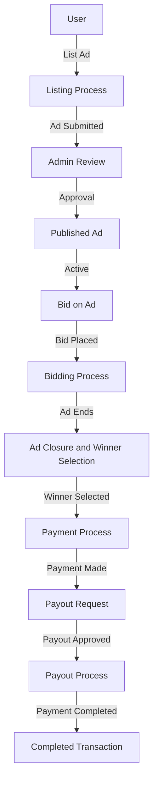
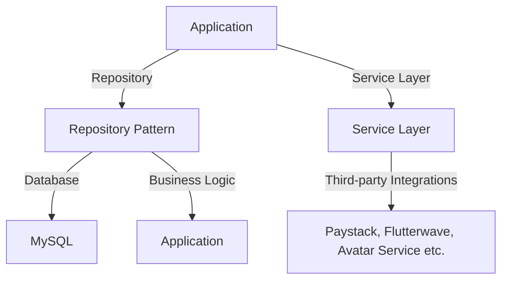
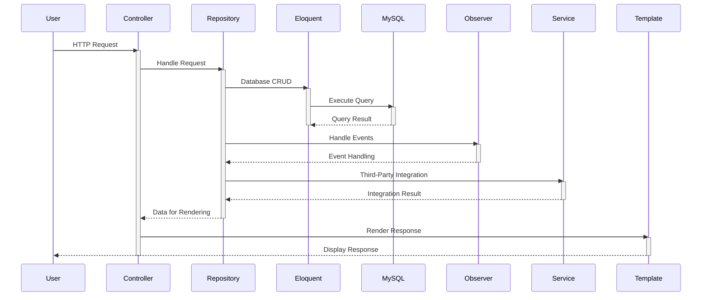
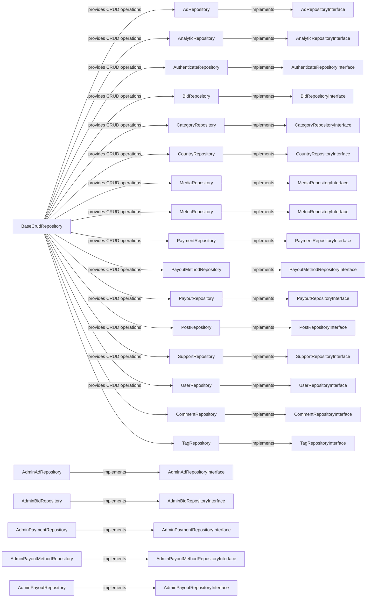
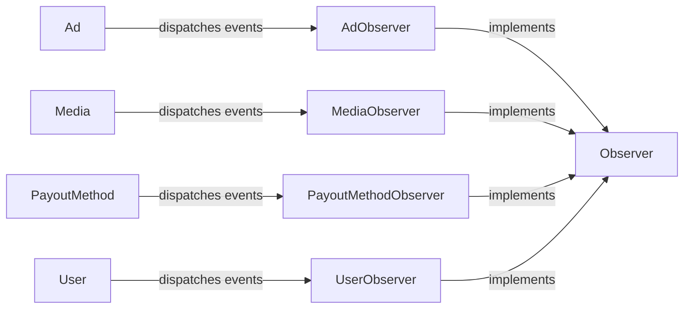
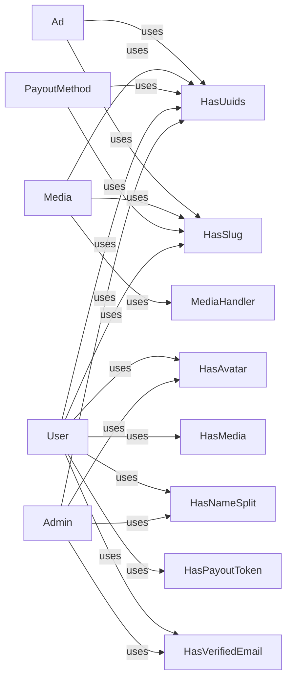
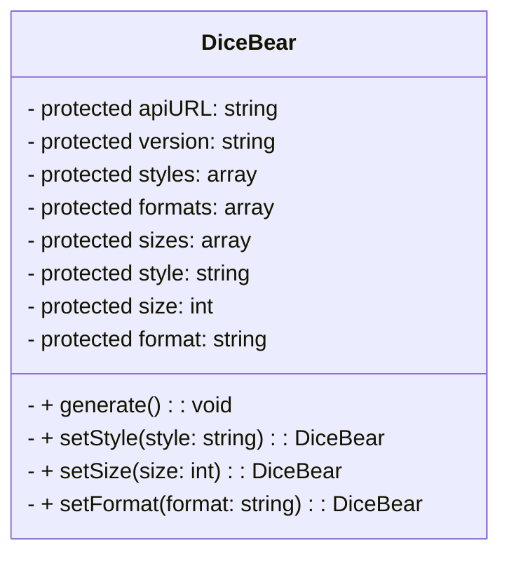
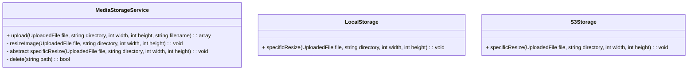
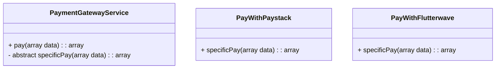

# Bazaar Technical Documentation

## Table of Contents
- [Introduction](#introduction)
- [Technologies Used](#technologies-used)
- [Problem Statement](#problem-statement)
- [Solution](#solution)
- [User Stories](#user-stories)
- [Technical Decisions](#technical-decisions)
- [Requests Lifecycle](#requests-lifecycle)
- [App Folder Structure](#app-folder-structure)
- [Database Schema](#database-schema)
- [Design Patterns Used](#design-patterns-used)
- [Large Database Test](#large-database-test)
- [Third-party Integrations](#third-party-integrations)
- [References](#references)


## Introduction
Bazaar Auction Platform is an online auction system that allows users to list their ads for auction. It provides a user-friendly interface for both ad owners and bidders, with features such as ad listing, bidding, automated workflows, payment processing, and payout requests.

<p align="right">(<a href="#table-of-contents">back to top</a>)</p>
## Technologies Used
<table>
  <tr>
    <td align="center"><a href="https://php.net/"></a></td>
    <td align="center"><a href="https://laravel.com/"></a></td>
    <td align="center"><a href="https://www.mysql.com/"></a></td>
    <td align="center"><a href="https://www.javascript.com/"></a></td>
    <td align="center"><a href="https://getbootstrap.com/"></a></td>
    <td align="center"><a href="https://www.w3.org/html/"></a></td>
    <td align="center"><a href="https://www.w3.org/html/"></a></td>
    <td align="center"><a href="https://www.w3.org/html/"></a></td>
    <td align="center"><a href="https://www.w3.org/html/"></a></td>
    </tr>
</table>

<p align="right">(<a href="#📗-table-of-contents">back to top</a>)</p>

## Problem Statement
The problem that we are trying to solve is that there is no auction marketplace for local users to buy and sell items. There are many online marketplaces such as Facebook and Craiglist, but they are not local and are not auction based. We want to create a local auction marketplace where users can buy and sell items.

<p align="right">(<a href="#📗-table-of-contents">back to top</a>)</p>

## Solution
Our solution is to create a full stack web application that allows users to create an account, list items for sale, bid on items, and view their own items and bids. The application will be built with Laravel framework, MySQL database, and Bootstrap front-end framework.

<p align="right">(<a href="#📗-table-of-contents">back to top</a>)</p>

## User Stories

#### User Story 1: Listing an Ad
- Scenario: A user wants to list an ad for auction.
-  Action:
    - User navigates to the application.
    - Chooses to list an ad without signing up.
    - Fills in the ad details (title, description, duration, etc.).
    - Submits the ad for review.
- Outcome:
    - Ad status is set to pending.
    - Admin receives a notification for ad review.
#### User Story 2: Admin Review
- Scenario: Admin receives a notification for ad review.
- Action:
    - Admin logs into the admin dashboard.
    - Reviews the pending ad.
    - Approves or rejects the ad.
- Outcome:
    - If approved, the ad status changes to published.
    - If rejected, the user is notified with feedback.
#### User Story 3: Bidding Process
- Scenario: Users want to bid on an active ad.
- Action:
    - Users browse active ads.
    - Places a bid on the desired ad.
- Outcome:
    - Bidding status is updated for the ad.
    - Owner of the ad receives bid notifications.
#### User Story 4: Ad Closure and Winner Selection
- Scenario: Ad duration expires or owner manually closes the ad.
- Action:
    - System automatically closes ads with ended duration.
    - Owner manually closes the ad.
    - Winner is automatically selected or chosen by the owner.
- Outcome:
    - Ad status changes to closed.
    - Notifications are sent to the ad owner and winning bidder.
#### User Story 5: Payment Process
- Scenario: Owner wants to accept a bid and initiate payment.
- Action:
    - Ad owner accepts a bid.
    - User receives a notification to make payment.
    - User makes payment using Paystack or Flutterwave.
- Outcome:
    - Ad owner receives notification of successful payment.
    - User receives a notification that the ad has been paid for.
#### User Story 6: Payout Request
- Scenario: Ad owner wants to request a payout.
- Action:
    - Ad owner navigates to payout section.
    - Chooses a payout method (e.g., bank transfer).
    - Initiates a payout request.
- Outcome:
    - Payout request is sent to the admin for approval.
    - Admin approves and processes the payout.

<p align="right">(<a href="#📗-table-of-contents">back to top</a>)</p>

## Technical Decisions
#### Why a Monolithic Architecture?
If it ain't broke, don't fix it. A monolithic architecture is a tried and true approach to building web applications. It's simple, easy to understand, and easy to maintain. It's also easy to scale horizontally by adding more servers to the cluster. The downside is that it's not as flexible as a microservices architecture, but that's not a problem for Bazaar Auction Platform. If it requires more flexibility in the future, we can always split the different components into separate services like database on one server, application on another server, etc (reason for docker).

#### Why PHP?
PHP is a workhouse, although it might not be the trendiest tech in town, but for Bazaar Auction Platform, it was the perfect fit. Why? It's built for the web, meaning its code practically renders HTML (Server Side Rendering) with ease. Plus, its static typing keeps things squeaky clean – fewer bugs, smoother sailing (reason for PHP 8.2).

#### Why Laravel?
Since Laravel has out-of-the-box support for most of the features we needed, it was the perfect fit for Bazaar Auction Platform. Laravel is a PHP framework that provides a robust set of features for web development, including authentication, authorization, database management, and more. The Eloquent ORM makes it easy to work with relational databases, and the Blade templating engine provides a clean, easy-to-use syntax for writing views. It also supports dependency injection and MVC – basically, what we needed for Bazaar Auction Platform.

#### Why MySQL?
MySQL was chosen as the primary database management system for Bazaar Auction Due to the relational paradigm of database tables for Bazaar Auction Platform it seems like the right fit. The use of indexes and foreign keys will help to ensure that Bazaar Auction Platform is fast and reliable.
> I did a test with up to 1,000,000 records for the `payments` table and it was blazing fast. Read more about it [here](#large-database-test).

#### Why an MVC Architecture?
Laravel is built on the MVC architecture, so it was the obvious choice for Bazaar Auction Platform. The MVC architecture separates the application into three main components: the model, the view, and the controller. The model is responsible for managing the data, the view is responsible for displaying the data, and the controller is responsible for handling user input and updating the model and view accordingly. This separation of concerns makes it easier to maintain and extend the application.

#### Why Docker?
Docker is a containerization platform that allows us to package our application into a container and run it on any machine with Docker installed. It also allows us to easily scale our application by adding more containers to the cluster. Docker is also great for testing and development because it allows us to easily spin up a containerized version of our application on our local machine.

#### Why Repository Design Pattern? And Why Not Service Layer Included?
Since we have a lot of database queries, we decided to use the repository design pattern to handle database and business logic. This makes it easier to test and maintain the application. We also decided to scrape the service layer and used the repository pattern to handle all the business logic and database queries, while the service layer handles third-party integrations. The repository pattern created an abstraction layer and made decoupling easier.



<p align="right">(<a href="#📗-table-of-contents">back to top</a>)</p>

## Requests Lifecycle


This sequence diagram illustrates the interaction between the User, Controller, Repository, Eloquent (for database CRUD operations), MySQL (the database), Observer (for handling events), Service (for third-party integration), and Template (for rendering the response). The sequence starts with the User making an HTTP request, which is then handled by the Controller. The Controller interacts with the Repository to manage data and business logic. The Repository, in turn, utilizes Eloquent for database CRUD operations, MySQL for the database, Observer for handling events, and Service for third-party integration. Finally, the response data is sent back to the Controller, and the Template renders the response for the User to view.

<p align="right">(<a href="#📗-table-of-contents">back to top</a>)</p>

## App Folder Structure
``` bash
├── Abstracts
│   ├── BaseAvatarService.php
│   ├── BaseCrudRepository.php
│   └── BaseMediaStorageService.php
├── Console
│   ├── Commands
│   │   ├── MakeInterfaceCommand.php
│   │   └── MakeRepositoryCommand.php
│   └── Kernel.php
├── Contracts
│   ├── Repositories
│   │   ├── AdRepositoryInterface.php
│   │   ├── AdminAdRepositoryInterface.php
│   │   ├── AdminBidRepositoryInterface.php
│   │   ├── AdminPaymentRepositoryInterface.php
│   │   ├── AdminPayoutMethodRepositoryInterface.php
│   │   ├── AdminPayoutRepositoryInterface.php
│   │   ├── AnalyticRepositoryInterface.php
│   │   ├── AuthenticateRepositoryInterface.php
│   │   ├── BidRepositoryInterface.php
│   │   ├── CategoryRepositoryInterface.php
│   │   ├── CommentRepositoryInterface.php
│   │   ├── CountryRepositoryInterface.php
│   │   ├── MediaRepositoryInterface.php
│   │   ├── MetricRepositoryInterface.php
│   │   ├── PaymentRepositoryInterface.php
│   │   ├── PayoutMethodRepositoryInterface.php
│   │   ├── PayoutRepositoryInterface.php
│   │   ├── PostRepositoryInterface.php
│   │   ├── SupportRepositoryInterface.php
│   │   ├── TagRepositoryInterface.php
│   │   └── UserRepositoryInterface.php
│   ├── Services
│   │   ├── AvatarServiceInterface.php
│   │   ├── BankCodeServiceInterface.php
│   │   ├── MediaStorageServiceInterface.php
│   │   └── PaymentGatewayServiceInterface.php
│   └── Types
│       ├── HasAll.php
│       ├── HasColor.php
│       └── HasLabel.php
├── Enums
│   ├── AdStatus.php
│   ├── AdType.php
│   ├── CommentStatus.php
│   ├── Gender.php
│   ├── MediaType.php
│   ├── PaymentGateway.php
│   ├── PaymentStatus.php
│   ├── PayoutGateway.php
│   ├── PayoutStatus.php
│   ├── PriceRange.php
│   ├── StorageDiskType.php
│   └── SupportStatusEnum.php
├── Exceptions
│   ├── AdException.php
│   ├── AuthenticateException.php
│   ├── BidCustomException.php
│   ├── BidException.php
│   ├── CommentException.php
│   ├── Handler.php
│   ├── MediaException.php
│   ├── PaymentException.php
│   ├── PayoutException.php
│   ├── PayoutMethodException.php
│   ├── PostException.php
│   ├── SupportException.php
│   └── UserException.php
├── Handler
│   ├── PaystackWebhookSignature.php
│   ├── ProcessPaystackPayout.php
│   └── ProcessPaystackWebhook.php
├── Helpers
│   └── Helpers.php
├── Http
│   ├── Controllers
│   │   ├── Admin
│   │   │   ├── Ad
│   │   │   │   └── AdController.php
│   │   │   ├── Auth
│   │   │   │   ├── LoginController.php
│   │   │   │   └── PasswordController.php
│   │   │   ├── Bid
│   │   │   │   └── BidController.php
│   │   │   ├── Dashboard
│   │   │   │   └── MetricsController.php
│   │   │   ├── Media
│   │   │   │   └── MediaController.php
│   │   │   ├── Payment
│   │   │   │   └── PaymentController.php
│   │   │   ├── Payout
│   │   │   │   ├── PayoutController.php
│   │   │   │   └── PayoutMethodController.php
│   │   │   ├── Post
│   │   │   │   ├── CommentController.php
│   │   │   │   └── PostController.php
│   │   │   ├── Profile
│   │   │   │   └── ProfileController.php
│   │   │   ├── Search
│   │   │   │   └── SearchController.php
│   │   │   ├── Support
│   │   │   │   └── SupportController.php
│   │   │   └── User
│   │   │       └── UserController.php
│   │   ├── Api
│   │   │   ├── CategoryController.php
│   │   │   └── CountryController.php
│   │   ├── Controller.php
│   │   ├── Page
│   │   │   ├── BlogController.php
│   │   │   ├── CommentController.php
│   │   │   ├── ContactController.php
│   │   │   └── HomeController.php
│   │   └── User
│   │       ├── Ad
│   │       │   └── AdController.php
│   │       ├── Auth
│   │       │   ├── LoginController.php
│   │       │   ├── PasswordController.php
│   │       │   └── RegisterController.php
│   │       ├── Bid
│   │       │   └── BidController.php
│   │       ├── Payment
│   │       │   └── PaymentController.php
│   │       ├── Payout
│   │       │   ├── PayoutController.php
│   │       │   └── PayoutMethodController.php
│   │       └── Profile
│   │           └── ProfileController.php
│   ├── Kernel.php
│   ├── Middleware
│   │   ├── Authenticate.php
│   │   ├── EncryptCookies.php
│   │   ├── EnsureAccountActive.php
│   │   ├── EnsureEmailVerified.php
│   │   ├── IncreaseAdViews.php
│   │   ├── PreventRequestsDuringMaintenance.php
│   │   ├── RedirectIfAuthenticated.php
│   │   ├── TrimStrings.php
│   │   ├── TrustHosts.php
│   │   ├── TrustProxies.php
│   │   ├── ValidateSignature.php
│   │   └── VerifyCsrfToken.php
│   └── Requests
│       ├── Ad
│       │   ├── CreateAdRequest.php
│       │   ├── CreateBidRequest.php
│       │   ├── FilterAdRequest.php
│       │   ├── FilterAdminAdsRequest.php
│       │   ├── FilterUserAdsRequest.php
│       │   ├── ReportAdRequest.php
│       │   ├── UpdateAdAdminRequest.php
│       │   └── UpdateAdRequest.php
│       ├── Auth
│       │   ├── ForgotPasswordRequest.php
│       │   ├── LoginRequest.php
│       │   ├── RegisterRequest.php
│       │   └── ResetPasswordRequest.php
│       ├── Bid
│       │   ├── FilterAdminBidRequest.php
│       │   └── FilterUserBidRequest.php
│       ├── Media
│       │   └── FilterAdminMediaRequest.php
│       ├── Payment
│       │   ├── CreatePayRequest.php
│       │   ├── FilterAdminPaymentRequest.php
│       │   ├── FilterUserPaymentRequest.php
│       │   └── UpdatePaymentAdminStatus.php
│       ├── Payout
│       │   ├── CreatePayoutMethodRequest.php
│       │   ├── FilterAdminPayoutMethodRequest.php
│       │   ├── FilterAdminPayoutRequest.php
│       │   └── RequestPayout.php
│       ├── Post
│       │   ├── CreateCommentRequest.php
│       │   ├── CreatePostRequest.php
│       │   ├── FilterAdminCommentRequest.php
│       │   ├── FilterAdminPostRequest.php
│       │   ├── FilterPostRequest.php
│       │   ├── UpdateCommentRequest.php
│       │   └── UpdatePostRequest.php
│       ├── Profile
│       │   ├── UpdateAdminPasswordRequest.php
│       │   ├── UpdateAdminProfileRequest.php
│       │   └── UpdateProfileRequest.php
│       ├── Search
│       │   └── SearchQueryRequest.php
│       ├── Support
│       │   ├── CreateSupportRequest.php
│       │   ├── FilterAdminSupportRequest.php
│       │   └── UpdateSupportRequest.php
│       └── User
│           ├── CreateAdminUserRequest.php
│           ├── FilterAdminUserRequest.php
│           └── UpdateAdminUserRequest.php
├── Jobs
│   ├── CreateTransferRecipient.php
│   ├── ProcessDailyPayouts.php
│   ├── ProcessHighestBidder.php
│   └── TieUserToAds.php
├── Models
│   ├── Ad.php
│   ├── Admin.php
│   ├── Bid.php
│   ├── Category.php
│   ├── City.php
│   ├── Comment.php
│   ├── Country.php
│   ├── Media.php
│   ├── Payment.php
│   ├── Payout.php
│   ├── PayoutMethod.php
│   ├── Post.php
│   ├── ReportAd.php
│   ├── State.php
│   ├── Support.php
│   ├── Tag.php
│   ├── Timezone.php
│   └── User.php
├── Notifications
│   ├── Ad
│   │   ├── AdCreatedNotification.php
│   │   └── AdStatusUpdatedNotification.php
│   ├── Bid
│   │   ├── BidAcceptedNotification.php
│   │   ├── BidCreatedNotification.php
│   │   └── BidRejectedNotification.php
│   ├── Payment
│   │   └── BidPaymentNotification.php
│   ├── Payout
│   │   ├── PayoutMethodCreatedNotification.php
│   │   ├── PayoutRequestNotification.php
│   │   └── PayoutStatusNotification.php
│   ├── Support
│   │   └── SupportTicketNotification.php
│   └── User
│       ├── PasswordResetNotification.php
│       ├── UserVerificationNotification.php
│       └── WelcomeEmailNotification.php
├── Observers
│   ├── AdObserver.php
│   ├── MediaObserver.php
│   ├── PayoutMethodObserver.php
│   └── UserObserver.php
├── Providers
│   ├── AppServiceProvider.php
│   ├── AuthServiceProvider.php
│   ├── BroadcastServiceProvider.php
│   ├── EventServiceProvider.php
│   ├── RepositoryServiceProvider.php
│   └── RouteServiceProvider.php
├── Repositories
│   ├── Ad
│   │   ├── Admin
│   │   │   └── AdminAdRepository.php
│   │   └── User
│   │       └── AdRepository.php
│   ├── Analytic
│   │   └── AnalyticRepository.php
│   ├── Auth
│   │   └── AuthenticateRepository.php
│   ├── Bid
│   │   ├── Admin
│   │   │   └── AdminBidRepository.php
│   │   └── User
│   │       └── BidRepository.php
│   ├── Category
│   │   └── CategoryRepository.php
│   ├── Country
│   │   └── CountryRepository.php
│   ├── Media
│   │   └── MediaRepository.php
│   ├── Metric
│   │   └── MetricRepository.php
│   ├── Payment
│   │   ├── Admin
│   │   │   └── AdminPaymentRepository.php
│   │   └── User
│   │       └── PaymentRepository.php
│   ├── Payout
│   │   ├── Admin
│   │   │   ├── AdminPayoutMethodRepository.php
│   │   │   └── AdminPayoutRepository.php
│   │   └── User
│   │       ├── PayoutMethodRepository.php
│   │       └── PayoutRepository.php
│   ├── Post
│   │   ├── CommentRepository.php
│   │   ├── PostRepository.php
│   │   └── TagRepository.php
│   ├── Support
│   │   └── SupportRepository.php
│   └── User
│       └── UserRepository.php
├── Rules
│   └── Username.php
├── Services
│   ├── Avatar
│   │   ├── BoringAvatar.php
│   │   ├── DiceBear.php
│   │   ├── Gravatar.php
│   │   └── UIAvatar.php
│   ├── Media
│   │   ├── LocalStorage.php
│   │   ├── MediaStorageService.php
│   │   └── S3Storage.php
│   ├── Payment
│   │   ├── PayWithFlutterwave.php
│   │   ├── PayWithPaystack.php
│   │   └── PaymentGatewayService.php
│   └── Payout
│       └── BankCodeService.php
└── Traits
    ├── ApiResponse.php
    ├── HasAvatar.php
    ├── HasMedia.php
    ├── HasNameSplit.php
    ├── HasPayoutToken.php
    ├── HasSlug.php
    ├── HasTransactionID.php
    ├── HasUuids.php
    ├── HasVerifiedEmail.php
    ├── MediaHandler.php
    └── PasswordEnvironments.php
```

<p align="right">(<a href="#📗-table-of-contents">back to top</a>)</p>

## Database Schema
The database schema for Bazaar Auction Platform is shown below. It consists of 18 tables, including users, ads, bids, payments, payouts, and more. The schema was designed to be as simple as possible while still providing all the necessary functionality for the application.


### Database Relationship
The database relationships for the Bazaar Auction Platform are shown below:
* **Country Model:**
    - One-to-Many with States
    - One-to-Many with Timezones
    - One-to-Many with Users
    - One-to-Many with Admins
    - One-to-Many with Ads (country_id)

* **State Model:**
    - Many-to-One with Country
    - One-to-Many with Cities
    - One-to-Many with Users
    - One-to-Many with Admins
    - One-to-Many with Ads (state_id)

* **City Model:**
    - Many-to-One with State
    - One-to-Many with Ads (city_id)

* **Timezone Model:**
    - Many-to-One with Country

* **User Model:**
    - Belongs-to-One Country
    - Belongs-to-One State
    - Belongs-to-One City
    - Belongs-to-One Timezone
    - One-to-Many with Ads
    - One-to-Many with Media
    - One-to-Many with Bids
    - One-to-Many with Payments (payer_id, payee_id)
    - One-to-Many with PayoutMethods
    - One-to-Many with Payouts
    - One-to-Many with Comments

* **Admin Model:**
    - One-to-Many with Posts
    - One-to-Many with Comments
    - One-to-Many with Supports
    - One-to-Many with Users

* **Category Model:**
    - One-to-Many with Ads (category_id, sub_category_id)

* **Ad Model:**
    - Many-to-One with User
    - Many-to-One with Category
    - Many-to-One with SubCategory
    - Belongs-to-One Country
    - Belongs-to-One State
    - Belongs-to-One City
    - One-to-Many with Bids
    - One-to-Many with Payments
    - One-to-Many with Media
    - One-to-Many with ReportAds

- **Media Model:**
    - Many-to-One with User
    - Many-to-One Polymorphic with other models (mediaable_id, mediaable_type)

* **Bid Model:**
    - Many-to-One with User
    - Many-to-One with Ad

* **Payment Model:**
    - Many-to-One with Payer User
    - Many-to-One with Payee User
    - Many-to-One with Ad
    - Many-to-One with Bid

* **ReportAd Model:**
    - Many-to-One with Ad

* **Post Model:**
    - Many-to-One with Admin
    - Many-to-One with FeaturedImage Media
    - Many-to-Many with Tags

* **PayoutMethod Model:**
    - Many-to-One with User
    - Many-to-One with Country
    - One-to-Many with Payouts

* **Payout Model:**
    - Many-to-One with User
    - Many-to-One with PayoutMethod
    - Many-to-One with Payment

* **Tag Model:**
    - Many-to-Many with Post

* **PostTag Model:**
    - Many-to-One with Post
    - Many-to-One with Tag

* **Comment Model:**
    - Many-to-One with User
    - Many-to-One with Admin
    - Many-to-One with Post
    - Many-to-One with Parent Comment

* **Support Model:**
    -   Many-to-One with Assigned Admin


## Design Patterns Used
#### Repository Design Pattern

The repository pattern is a well-established design approach in software development that enhances code organization, modularity, and maintainability. At its core is the `BaseCrudRepository`, a foundational class providing generic CRUD operations (Create, Read, Update, Delete). Various specialized repositories, such as `AdRepository`, `AnalyticRepository`, etc., extend `BaseCrudRepository` to inherit common CRUD functionalities. Each repository implements a corresponding interface (e.g., `AdRepositoryInterface`, `AnalyticRepositoryInterface`) that defines the contract for that specific repository. This adherence to interfaces facilitates easy swapping of implementations, promoting code modularity and testability. On a side note, it is recommended to use the repository pattern with a Service Layer, but pick your poison. Service layer brings more complexity and boilerplate code, so we decided to skip it.

#### Observer Design Pattern

The observer pattern is a behavioral design pattern that allows objects in this cade `Models` to subscribe to events and be notified when those events occur. In Bazaar Auction Platform, the `Ad`, `Media`, `PayoutMethod`, and `User` models dispatch events when certain actions are performed on them. The `AdObserver`, `MediaObserver`, `PayoutMethodObserver`, and `UserObserver` classes subscribe to these events and perform actions accordingly. For example, when an ad is created, the `AdObserver` class will be notified and will perform actions such as sending notifications to the ad owner and updating the ad status.

#### Traits

Traits are a great way to reuse code across multiple classes. In Bazaar Auction Platform, we use traits to add functionality to the `Ad`, `Media`, `PayoutMethod`, and `User` models. For example, the `HasUuids` trait adds the ability to generate UUIDs for the models, while the `HasSlug` trait adds the ability to generate slugs for the models. The `HasAvatar`, `HasMedia`, `HasNameSplit`, `HasPayoutToken`, and `HasVerifiedEmail` traits add functionality to the `User` model, such as generating avatars, splitting names, generating payout tokens, and verifying emails. Finally, the `MediaHandler` trait adds functionality to the `Media` model, such as uploading and deleting media files.

#### Service Layer with Builder Pattern
All the third-party Avatar integration is handled by Builders pattern which is a creation design pattern that allows us to create complex objects step by step. The builder pattern is a creational design pattern that allows us to create complex objects step by step. It is often used when the construction process of an object is complex and involves multiple steps. The builder pattern is a creational design pattern that allows us to create complex objects step by step. It is often used when the construction process of an object is complex and involves multiple steps. In Bazaar Auction Platform, we use the builder pattern to create avatars. The `BaseAvatarService` class acts as the director, while the `Gravatar`, `UIAvatar`, `BoringAvatar`, and `DiceBear` classes act as the concrete builders. The `BaseAvatarService` class provides the `generate` method, which is responsible for assembling the parts and creating the final object, which is an avatar in this case. The `Gravatar`, `UIAvatar`, `BoringAvatar`, and `DiceBear` classes provide the `setStyle`, `setSize`, and `setFormat` methods, which allow setting different attributes of the object. Example of the `DiceBear` class below:

The DiceBear class acts as the concrete builder. The various properties such as `$apiUrl`, `$version`, `$styles`, `$formats`, `$sizes`, `$style`, `$size`, and `$format` represent the parts of the complex object being constructed. The `generate` method is responsible for assembling the parts and creating the final object, which is an avatar in this case. The `setStyle`, `setSize`, and `setFormat` methods are the builder methods that allow setting different attributes of the object.

#### Service Layer with Template Method Pattern (Strategy Pattern as well)
In the service layer, the MediaStorageService class utilizes the Template Method Pattern to define a common algorithm for uploading media files while allowing specific steps to be implemented by concrete subclasses. This pattern enhances code reusability and promotes a consistent structure for media file handling.


The `MediaStorageService` class serves as an abstract template for the handling of media files, defining a structured algorithm for both uploading and deleting operations. The core of this class is the `upload` template method, which outlines the overall process of media file management. Within this template, the `resizeImage` method functions as a hook or primitive operation, strategically positioned for customization by concrete subclasses. Concrete implementations, exemplified by `LocalStorage` and `S3Storage`, extend the `MediaStorageService` class and supply specific logic for the `specificResize` method. This method, intricately linked with the `resizeImage` hook, allows subclasses to tailor their unique approaches to resizing images. The use of the Template Method Pattern is apparent in this design, as the template method encapsulates common steps, providing a consistent structure for media file handling, while the `resizeImage` hook invites concrete subclasses to define their distinctive resizing strategies through the implementation of the `specificResize` method. This pattern promotes code reusability, a clear separation of concerns, and flexibility in extending or customizing the behavior of media file management.

#### Service Layer with Strategy Pattern
In the service layer, the `PaymentGatewayService` class utilizes the Strategy Pattern to define a common algorithm for processing payments while allowing specific steps to be implemented by concrete subclasses. This pattern enhances code reusability and promotes a consistent structure for payment processing.


The `PaymentGatewayService` class contains the `pay` method, which outlines the overall process of payment processing. Each concrete implementation, exemplified by `PayWithPaystack` and `PayWithFlutterwave`, implements the `specificPay` method, which allows subclasses to tailor their unique approaches to payment processing. The use of the Strategy Pattern is apparent in this design, as the `pay` method encapsulates common steps, providing a consistent structure for payment processing, while the `specificPay` method invites concrete subclasses to define their distinctive payment strategies. This pattern promotes code reusability, a clear separation of concerns, and flexibility in extending or customizing the behavior of payment processing.

<p align="right">(<a href="#📗-table-of-contents">back to top</a>)</p>

## Large Database Test
I did a test with up to 1,000,000 records for the `payments` table and it was blazing fast. The test was done on a local machine with M2 Macbook Pro base model. The test was done with the following specs:
- PHP 8.0.2
- MySQL 8.0.23
- Laravel 10.0.0


As you can see from the image above, the `payments` table has over 1,000,000 records. The test was done with the following query:


``` php
$payments = Payment::query()
    ->with(['payee:id,name,username,avatar', 'payer:id,name,username,avatar', 'payout:id,user_id,payout_method_id,payment_id,amount,fee'])
    ->paginate(10);
```
In the actual application, the query was more complex, due to the need to filter the results based on query parameters. The size of the database table can be improved, having an index size of up to 100MB which is around 55% of the actual table size. We can look into using a different identifier algorithm like ULID or other preferred option instead of _Ordered UUID_,  which will reduce the size of the index and improve performance. Also caching can also bring improvement to the response time.


<p align="right">(<a href="#📗-table-of-contents">back to top</a>)</p>

## Third-party Integrations
#### Payment Gateway
- [Paystack](https://paystack.com/)
- [Flutterwave](https://flutterwave.com/)
#### Avatar Service
- [DiceBear](https://avatars.dicebear.com/)
- [UIAvatar](https://ui-avatars.com/)
- [BoringAvatar](https://boringavatars.com/)
- [Gravatar](https://gravatar.com/)
#### Media Storage
- [Amazon S3](https://aws.amazon.com/s3/)
- [Local Storage](https://laravel.com/docs/10.x/filesystem#the-public-disk)

<p align="right">(<a href="#📗-table-of-contents">back to top</a>)</p>

## References
- [Laravel Documentation](https://laravel.com/docs/10.x)
- [Laravel Best Practices](https://github.com/alexeymezenin/laravel-best-practices)
- [Refactoring Guru](https://refactoring.guru/design-patterns)
- [Laravel Design Patterns and Best Practices](https://www.packtpub.com/product/laravel-design-patterns-and-best-practices/9781783287987)
- And many more...
